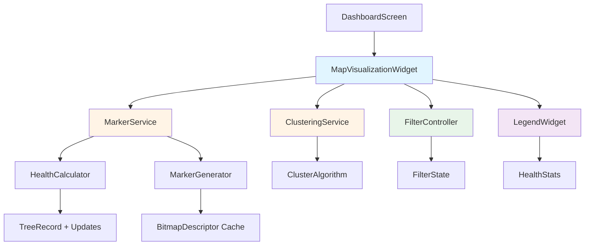

# Design Document: Enhanced Map Visualization

## Overview

This design document outlines the implementation of an enhanced map visualization system for the GeoCamera tree plantation tracking app. The feature replaces standard Google Maps red pin markers with custom circular dot markers that are color-coded based on tree health status, includes clustering for zoomed-out views, provides filtering capabilities, and displays a collapsible legend. The system dynamically determines tree health by analyzing the latest update condition and time elapsed since the last update, enabling NGO workers to quickly identify trees requiring attention.

The implementation leverages Flutter's google_maps_flutter package with custom BitmapDescriptor markers, integrates with the existing TreeRecord and TreeUpdate data models, and maintains consistency with the current dashboard search functionality. The design prioritizes performance through efficient marker generation, smooth animations, and intelligent clustering algorithms.

## Architecture



## Main Algorithm/Workflow

```mermaid
sequenceDiagram
    participant DS as DashboardScreen
    participant MV as MapVisualizationWidget
    participant HC as HealthCalculator
    participant MG as MarkerGenerator
    participant CS as ClusteringService
    participant GM as GoogleMap
    
    DS->>MV: Load trees data
    MV->>HC: Calculate health for each tree
    HC-->>MV: Health status + color
    MV->>MG: Generate markers with health colors
    MG->>MG: Create/retrieve cached BitmapDescriptors
    MG-->>MV: Set of Marker objects
    MV->>CS: Check if clustering needed (zoom level)
    alt Zoomed Out
        CS->>CS: Apply clustering algorithm
        CS-->>MV: Clustered markers
    else Zoomed In
        CS-->>MV: Individual markers
    end
    MV->>GM: Update map with markers
    GM-->>DS: Display enhanced map


## Components and Interfaces

### Component 1: HealthCalculator

**Purpose**: Determines the health status and color for each tree based on latest update condition and time elapsed.

**Interface**:
```dart
class HealthCalculator {
  static TreeHealthStatus calculateHealth(TreeRecord tree);
  static Color getHealthColor(HealthStatus status);
  static int getDaysSinceLastUpdate(TreeRecord tree);
}

enum HealthStatus {
  healthy,      // Green
  needsAttention, // Yellow
  critical,     // Red
  newPlantation // Gray
}

class TreeHealthStatus {
  final HealthStatus status;
  final Color color;
  final String reason;
  final int daysSinceUpdate;
  
  TreeHealthStatus({
    required this.status,
    required this.color,
    required this.reason,
    required this.daysSinceUpdate,
  });
}
```

**Responsibilities**:
- Analyze TreeRecord and its updates list to determine current health
- Apply business rules: Good condition = Green, Moderate = Yellow, Poor = Red
- Check time-based rules: 30+ days = Yellow, 60+ days = Red
- Handle edge case of new plantations with no updates (Gray)
- Provide human-readable reason for health status


### Component 2: MarkerGenerator

**Purpose**: Creates custom circular dot markers with appropriate colors and sizes, manages BitmapDescriptor cache.

**Interface**:
```dart
class MarkerGenerator {
  static Future<BitmapDescriptor> createCircularMarker({
    required Color color,
    required double size,
    bool shouldPulse = false,
  });
  
  static Future<BitmapDescriptor> createClusterMarker({
    required Color color,
    required int count,
    required double size,
  });
  
  static void clearCache();
  
  static Future<Set<Marker>> generateMarkersForTrees(
    List<TreeRecord> trees,
    Function(String treeId) onTap,
  );
}
```

**Responsibilities**:
- Generate circular dot BitmapDescriptors programmatically using Canvas
- Cache generated markers to avoid redundant creation
- Vary marker size based on number of updates (base size + scale factor)
- Create cluster markers with count labels
- Add optional pulsing animation for critical trees
- Convert TreeRecord list to Google Maps Marker set


### Component 3: ClusteringService

**Purpose**: Groups nearby markers into clusters when zoomed out, expands to individual markers when zoomed in.

**Interface**:
```dart
class ClusteringService {
  static const double clusteringZoomThreshold = 12.0;
  static const double clusteringDistanceThreshold = 0.01; // degrees
  
  static List<MapItem> clusterTrees(
    List<TreeRecord> trees,
    double currentZoom,
  );
  
  static Color getClusterColor(List<TreeRecord> treesInCluster);
}

abstract class MapItem {}

class IndividualTreeItem extends MapItem {
  final TreeRecord tree;
  IndividualTreeItem(this.tree);
}

class ClusterItem extends MapItem {
  final List<TreeRecord> trees;
  final LatLng center;
  final Color color;
  
  ClusterItem({
    required this.trees,
    required this.center,
    required this.color,
  });
}
```

**Responsibilities**:
- Determine if clustering should be applied based on zoom level
- Apply distance-based clustering algorithm (grid-based or k-means)
- Calculate cluster center point (centroid of tree locations)
- Determine cluster color based on worst health status in cluster
- Return mixed list of individual trees and clusters for rendering


### Component 4: FilterController

**Purpose**: Manages filter state and applies health-based filtering to tree list.

**Interface**:
```dart
class FilterController extends ChangeNotifier {
  FilterMode _currentFilter = FilterMode.showAll;
  
  FilterMode get currentFilter => _currentFilter;
  
  void setFilter(FilterMode mode);
  
  List<TreeRecord> applyFilter(List<TreeRecord> trees);
  
  Map<HealthStatus, int> getHealthCounts(List<TreeRecord> trees);
}

enum FilterMode {
  showAll,
  healthyOnly,
  needsAttentionOnly,
  criticalOnly,
}
```

**Responsibilities**:
- Maintain current filter state
- Notify listeners when filter changes
- Apply filter logic to tree list based on health status
- Calculate counts for each health category
- Integrate with existing search functionality


### Component 5: LegendWidget

**Purpose**: Displays collapsible legend showing health status colors and counts.

**Interface**:
```dart
class MapLegendWidget extends StatefulWidget {
  final Map<HealthStatus, int> healthCounts;
  final bool initiallyExpanded;
  
  const MapLegendWidget({
    required this.healthCounts,
    this.initiallyExpanded = true,
  });
}

class _MapLegendWidgetState extends State<MapLegendWidget> {
  bool _isExpanded = true;
  
  void _toggleExpanded();
  
  Widget _buildLegendItem(HealthStatus status, Color color, int count);
}
```

**Responsibilities**:
- Display floating legend overlay on map
- Show color-coded legend items with labels and counts
- Provide expand/collapse functionality
- Position legend in non-intrusive location (top-right or bottom-left)
- Update counts dynamically when filters change


### Component 6: MapVisualizationWidget

**Purpose**: Main widget that orchestrates all map visualization components and integrates with dashboard.

**Interface**:
```dart
class MapVisualizationWidget extends StatefulWidget {
  final List<TreeRecord> trees;
  final Function(String treeId) onTreeTap;
  
  const MapVisualizationWidget({
    required this.trees,
    required this.onTreeTap,
  });
}

class _MapVisualizationWidgetState extends State<MapVisualizationWidget> {
  GoogleMapController? _mapController;
  FilterController _filterController = FilterController();
  double _currentZoom = 12.0;
  Set<Marker> _markers = {};
  
  void _onMapCreated(GoogleMapController controller);
  void _onCameraMove(CameraPosition position);
  Future<void> _updateMarkers();
  void _onFilterChanged(FilterMode mode);
}
```

**Responsibilities**:
- Manage GoogleMap widget lifecycle
- Coordinate between all services (health, markers, clustering, filtering)
- Handle map camera changes and zoom level updates
- Trigger marker regeneration when filters or zoom changes
- Display legend widget as overlay
- Provide smooth animations during filter transitions


## Data Models

### Model 1: TreeHealthStatus

```dart
class TreeHealthStatus {
  final HealthStatus status;
  final Color color;
  final String reason;
  final int daysSinceUpdate;
  
  TreeHealthStatus({
    required this.status,
    required this.color,
    required this.reason,
    required this.daysSinceUpdate,
  });
}
```

**Validation Rules**:
- status must be one of the four HealthStatus enum values
- color must be valid Flutter Color object
- reason must be non-empty string
- daysSinceUpdate must be non-negative integer

### Model 2: MapItem (Abstract)

```dart
abstract class MapItem {
  LatLng get position;
  Color get color;
}

class IndividualTreeItem extends MapItem {
  final TreeRecord tree;
  final TreeHealthStatus healthStatus;
  
  @override
  LatLng get position => LatLng(tree.latitude, tree.longitude);
  
  @override
  Color get color => healthStatus.color;
  
  IndividualTreeItem({
    required this.tree,
    required this.healthStatus,
  });
}

class ClusterItem extends MapItem {
  final List<TreeRecord> trees;
  final LatLng center;
  final Color clusterColor;
  
  @override
  LatLng get position => center;
  
  @override
  Color get color => clusterColor;
  
  int get count => trees.length;
  
  ClusterItem({
    required this.trees,
    required this.center,
    required this.clusterColor,
  });
}
```

**Validation Rules**:
- IndividualTreeItem: tree must be non-null TreeRecord
- ClusterItem: trees list must contain at least 2 trees
- ClusterItem: center must be valid LatLng within bounds of clustered trees
- Both: position must have valid latitude (-90 to 90) and longitude (-180 to 180)


### Model 3: FilterState

```dart
class FilterState {
  final FilterMode mode;
  final Map<HealthStatus, int> healthCounts;
  final int totalVisible;
  
  FilterState({
    required this.mode,
    required this.healthCounts,
    required this.totalVisible,
  });
  
  FilterState copyWith({
    FilterMode? mode,
    Map<HealthStatus, int>? healthCounts,
    int? totalVisible,
  });
}

enum FilterMode {
  showAll,
  healthyOnly,
  needsAttentionOnly,
  criticalOnly,
}

enum HealthStatus {
  healthy,
  needsAttention,
  critical,
  newPlantation,
}
```

**Validation Rules**:
- mode must be valid FilterMode enum value
- healthCounts map must contain entries for all HealthStatus values
- All count values must be non-negative integers
- totalVisible must equal sum of all healthCounts values
- totalVisible must be <= total number of trees in dataset


## Key Functions with Formal Specifications

### Function 1: calculateHealth()

```dart
static TreeHealthStatus calculateHealth(TreeRecord tree)
```

**Preconditions:**
- tree is non-null TreeRecord object
- tree.dateTime is valid ISO 8601 datetime string
- tree.updates list is initialized (may be empty)
- If updates exist, each update has valid dateTime and condition fields

**Postconditions:**
- Returns valid TreeHealthStatus object
- status field matches one of four HealthStatus enum values
- color field corresponds to status (Green/Yellow/Red/Gray)
- daysSinceUpdate accurately reflects time elapsed
- reason field provides human-readable explanation

**Loop Invariants:** N/A (no loops in this function)

### Function 2: createCircularMarker()

```dart
static Future<BitmapDescriptor> createCircularMarker({
  required Color color,
  required double size,
  bool shouldPulse = false,
})
```

**Preconditions:**
- color is valid Flutter Color object
- size is positive number (typically 20-50 pixels)
- shouldPulse is boolean value

**Postconditions:**
- Returns valid BitmapDescriptor that can be used as Google Maps marker icon
- Generated marker is circular shape with specified color
- Marker size matches requested size parameter
- If shouldPulse is true, marker includes visual pulsing effect
- Result is cached for future reuse with same parameters

**Loop Invariants:** N/A (uses Canvas drawing, no explicit loops)


### Function 3: clusterTrees()

```dart
static List<MapItem> clusterTrees(
  List<TreeRecord> trees,
  double currentZoom,
)
```

**Preconditions:**
- trees is non-null list (may be empty)
- All trees have valid latitude and longitude values
- currentZoom is positive number (typically 1-20 for Google Maps)

**Postconditions:**
- Returns list of MapItem objects (mix of IndividualTreeItem and ClusterItem)
- If currentZoom >= clusteringZoomThreshold, returns individual items only
- If currentZoom < clusteringZoomThreshold, applies clustering algorithm
- Each tree appears in exactly one MapItem (no duplicates or omissions)
- Clusters contain at least 2 trees
- Cluster centers are within geographic bounds of their constituent trees

**Loop Invariants:**
- During clustering iteration: All processed trees are assigned to exactly one cluster or individual item
- Distance calculations remain consistent throughout iteration

### Function 4: applyFilter()

```dart
List<TreeRecord> applyFilter(List<TreeRecord> trees)
```

**Preconditions:**
- trees is non-null list of TreeRecord objects
- _currentFilter is valid FilterMode enum value
- Each tree can have its health status calculated

**Postconditions:**
- Returns filtered list of TreeRecord objects
- If filter is showAll, returns all trees unchanged
- If filter is healthyOnly, returns only trees with HealthStatus.healthy
- If filter is needsAttentionOnly, returns only trees with HealthStatus.needsAttention
- If filter is criticalOnly, returns only trees with HealthStatus.critical
- Returned list maintains original order of trees
- No trees are modified, only filtered

**Loop Invariants:**
- All previously checked trees either passed filter (included) or failed (excluded)
- Filter criteria remain constant throughout iteration


### Function 5: generateMarkersForTrees()

```dart
static Future<Set<Marker>> generateMarkersForTrees(
  List<TreeRecord> trees,
  Function(String treeId) onTap,
)
```

**Preconditions:**
- trees is non-null list of TreeRecord objects
- onTap is valid callback function accepting String parameter
- All trees have valid treeId, latitude, longitude
- MarkerGenerator cache is initialized

**Postconditions:**
- Returns Set of Marker objects for Google Maps
- Set size equals trees list length
- Each Marker has unique markerId matching tree.treeId
- Each Marker position matches tree's latitude/longitude
- Each Marker icon is custom BitmapDescriptor with health-based color
- Marker size varies based on tree.updates.length
- InfoWindow configured with tree details
- onTap callback properly bound to each marker

**Loop Invariants:**
- All previously processed trees have corresponding Marker in result set
- No duplicate markerIds exist in result set
- Health status calculations remain consistent


## Algorithmic Pseudocode

### Main Processing Algorithm: Update Map Visualization

```dart
ALGORITHM updateMapVisualization(trees, currentZoom, filterMode)
INPUT: trees (List<TreeRecord>), currentZoom (double), filterMode (FilterMode)
OUTPUT: Updated map with markers and legend

BEGIN
  ASSERT trees is non-null AND currentZoom > 0
  
  // Step 1: Calculate health status for all trees
  healthStatusMap ← empty Map<String, TreeHealthStatus>
  FOR each tree IN trees DO
    ASSERT tree.treeId is non-empty
    healthStatus ← calculateHealth(tree)
    healthStatusMap[tree.treeId] ← healthStatus
  END FOR
  
  // Step 2: Apply filter
  filteredTrees ← applyFilter(trees, filterMode, healthStatusMap)
  
  // Step 3: Determine if clustering needed
  IF currentZoom < CLUSTERING_ZOOM_THRESHOLD THEN
    mapItems ← clusterTrees(filteredTrees, currentZoom)
  ELSE
    mapItems ← convertToIndividualItems(filteredTrees, healthStatusMap)
  END IF
  
  // Step 4: Generate markers
  markers ← empty Set<Marker>
  FOR each item IN mapItems DO
    IF item is IndividualTreeItem THEN
      marker ← createIndividualMarker(item)
    ELSE IF item is ClusterItem THEN
      marker ← createClusterMarker(item)
    END IF
    markers.add(marker)
  END FOR
  
  // Step 5: Calculate legend counts
  healthCounts ← calculateHealthCounts(filteredTrees, healthStatusMap)
  
  // Step 6: Update UI
  updateMapMarkers(markers)
  updateLegend(healthCounts)
  
  ASSERT markers.length > 0 OR filteredTrees.isEmpty
  ASSERT sum(healthCounts.values) = filteredTrees.length
  
  RETURN success
END
```

**Preconditions:**
- trees list is non-null and contains valid TreeRecord objects
- currentZoom is positive number within valid Google Maps range (1-20)
- filterMode is valid FilterMode enum value

**Postconditions:**
- Map displays markers for all filtered trees
- Markers are either individual or clustered based on zoom level
- Legend shows accurate counts for each health category
- UI is updated with smooth animations
- No trees are lost or duplicated in visualization

**Loop Invariants:**
- Health calculation loop: All processed trees have health status in healthStatusMap
- Marker generation loop: All processed items have corresponding Marker in markers set
- No duplicate markers exist at any point


### Health Calculation Algorithm

```dart
ALGORITHM calculateHealth(tree)
INPUT: tree (TreeRecord with updates list)
OUTPUT: TreeHealthStatus object

BEGIN
  ASSERT tree is non-null
  
  currentDate ← getCurrentDate()
  
  // Case 1: No updates yet (new plantation)
  IF tree.updates.isEmpty THEN
    plantDate ← parseDate(tree.dateTime)
    daysSincePlant ← daysBetween(plantDate, currentDate)
    RETURN TreeHealthStatus(
      status: HealthStatus.newPlantation,
      color: GRAY_COLOR,
      reason: "New plantation, no updates yet",
      daysSinceUpdate: daysSincePlant
    )
  END IF
  
  // Case 2: Has updates - analyze latest update
  latestUpdate ← tree.updates[tree.updates.length - 1]
  updateDate ← parseDate(latestUpdate.dateTime)
  daysSinceUpdate ← daysBetween(updateDate, currentDate)
  
  // Determine status based on condition and time
  IF latestUpdate.condition = "Good" AND daysSinceUpdate < 30 THEN
    status ← HealthStatus.healthy
    color ← GREEN_COLOR
    reason ← "Good condition, recently updated"
  ELSE IF latestUpdate.condition = "Good" AND daysSinceUpdate >= 30 AND daysSinceUpdate < 60 THEN
    status ← HealthStatus.needsAttention
    color ← YELLOW_COLOR
    reason ← "Good condition but needs update (30+ days)"
  ELSE IF latestUpdate.condition = "Moderate" OR daysSinceUpdate >= 30 THEN
    status ← HealthStatus.needsAttention
    color ← YELLOW_COLOR
    reason ← "Moderate condition or overdue update"
  ELSE IF latestUpdate.condition = "Poor" OR daysSinceUpdate >= 60 THEN
    status ← HealthStatus.critical
    color ← RED_COLOR
    reason ← "Poor condition or critically overdue"
  ELSE
    status ← HealthStatus.healthy
    color ← GREEN_COLOR
    reason ← "Default healthy status"
  END IF
  
  RETURN TreeHealthStatus(
    status: status,
    color: color,
    reason: reason,
    daysSinceUpdate: daysSinceUpdate
  )
END
```

**Preconditions:**
- tree is non-null TreeRecord
- tree.dateTime is valid ISO 8601 datetime string
- tree.updates list is initialized (may be empty)
- If updates exist, each has valid dateTime and condition

**Postconditions:**
- Returns valid TreeHealthStatus with all fields populated
- Status matches color (Green=healthy, Yellow=needsAttention, Red=critical, Gray=new)
- daysSinceUpdate is accurate non-negative integer
- reason provides clear explanation of status

**Loop Invariants:** N/A (no loops, only conditional logic)


### Clustering Algorithm (Grid-Based)

```dart
ALGORITHM clusterTrees(trees, currentZoom)
INPUT: trees (List<TreeRecord>), currentZoom (double)
OUTPUT: List<MapItem> (mix of individual and cluster items)

BEGIN
  ASSERT trees is non-null AND currentZoom > 0
  
  // No clustering if zoomed in enough
  IF currentZoom >= CLUSTERING_ZOOM_THRESHOLD THEN
    result ← empty List<MapItem>
    FOR each tree IN trees DO
      healthStatus ← calculateHealth(tree)
      result.add(IndividualTreeItem(tree, healthStatus))
    END FOR
    RETURN result
  END IF
  
  // Calculate grid cell size based on zoom level
  cellSize ← calculateCellSize(currentZoom)
  
  // Group trees into grid cells
  grid ← empty Map<GridCell, List<TreeRecord>>
  FOR each tree IN trees DO
    cell ← getGridCell(tree.latitude, tree.longitude, cellSize)
    IF grid[cell] does not exist THEN
      grid[cell] ← empty List
    END IF
    grid[cell].add(tree)
  END FOR
  
  // Convert grid cells to MapItems
  result ← empty List<MapItem>
  FOR each cell, treesInCell IN grid DO
    ASSERT treesInCell.length > 0
    
    IF treesInCell.length = 1 THEN
      // Single tree - no clustering needed
      tree ← treesInCell[0]
      healthStatus ← calculateHealth(tree)
      result.add(IndividualTreeItem(tree, healthStatus))
    ELSE
      // Multiple trees - create cluster
      centerLat ← average(treesInCell.map(t => t.latitude))
      centerLng ← average(treesInCell.map(t => t.longitude))
      clusterColor ← determineClusterColor(treesInCell)
      
      result.add(ClusterItem(
        trees: treesInCell,
        center: LatLng(centerLat, centerLng),
        clusterColor: clusterColor
      ))
    END IF
  END FOR
  
  ASSERT result.length > 0 OR trees.isEmpty
  ASSERT totalTreesInResult(result) = trees.length
  
  RETURN result
END

FUNCTION calculateCellSize(zoom)
  // Smaller cells at higher zoom levels
  RETURN BASE_CELL_SIZE / (2 ^ (zoom - MIN_ZOOM))
END FUNCTION

FUNCTION getGridCell(lat, lng, cellSize)
  cellX ← floor(lng / cellSize)
  cellY ← floor(lat / cellSize)
  RETURN GridCell(cellX, cellY)
END FUNCTION

FUNCTION determineClusterColor(trees)
  // Use worst health status in cluster
  worstStatus ← HealthStatus.healthy
  FOR each tree IN trees DO
    status ← calculateHealth(tree).status
    IF status = HealthStatus.critical THEN
      worstStatus ← HealthStatus.critical
      BREAK
    ELSE IF status = HealthStatus.needsAttention AND worstStatus != HealthStatus.critical THEN
      worstStatus ← HealthStatus.needsAttention
    END IF
  END FOR
  RETURN getHealthColor(worstStatus)
END FUNCTION
```

**Preconditions:**
- trees is non-null list of TreeRecord objects
- currentZoom is positive number (1-20)
- All trees have valid latitude and longitude

**Postconditions:**
- Returns list of MapItem objects
- If zoomed in (>= threshold), all items are IndividualTreeItem
- If zoomed out (< threshold), items are mix of individual and clusters
- Each tree appears exactly once in result
- Clusters contain 2+ trees
- Total tree count preserved

**Loop Invariants:**
- Grid grouping loop: All processed trees are assigned to exactly one grid cell
- MapItem creation loop: All processed cells produce exactly one MapItem
- No trees are duplicated or lost


### Marker Generation Algorithm

```dart
ALGORITHM generateMarkersForTrees(trees, onTap)
INPUT: trees (List<TreeRecord>), onTap (callback function)
OUTPUT: Set<Marker> for Google Maps

BEGIN
  ASSERT trees is non-null AND onTap is non-null
  
  markers ← empty Set<Marker>
  
  FOR each tree IN trees DO
    ASSERT tree.treeId is non-empty
    ASSERT tree.latitude is valid AND tree.longitude is valid
    
    // Calculate health and determine marker properties
    healthStatus ← calculateHealth(tree)
    markerColor ← healthStatus.color
    
    // Size based on number of updates (more updates = slightly larger)
    baseSize ← 24.0
    updateCount ← tree.updates.length
    markerSize ← baseSize + (updateCount * 2.0)
    markerSize ← min(markerSize, 40.0) // Cap at 40 pixels
    
    // Critical trees get pulsing animation
    shouldPulse ← (healthStatus.status = HealthStatus.critical)
    
    // Generate or retrieve cached marker icon
    markerIcon ← createCircularMarker(
      color: markerColor,
      size: markerSize,
      shouldPulse: shouldPulse
    )
    
    // Create marker with info window
    marker ← Marker(
      markerId: MarkerId(tree.treeId),
      position: LatLng(tree.latitude, tree.longitude),
      icon: markerIcon,
      infoWindow: InfoWindow(
        title: tree.plantName,
        snippet: formatSnippet(tree, healthStatus),
        onTap: () => onTap(tree.treeId)
      )
    )
    
    markers.add(marker)
  END FOR
  
  ASSERT markers.length = trees.length
  ASSERT all markerIds are unique
  
  RETURN markers
END

FUNCTION formatSnippet(tree, healthStatus)
  updateInfo ← tree.updates.isEmpty ? "No updates" : "${tree.updates.length} updates"
  statusInfo ← healthStatus.reason
  RETURN "${updateInfo} • ${statusInfo}"
END FUNCTION
```

**Preconditions:**
- trees is non-null list of TreeRecord objects
- onTap is valid callback function
- All trees have unique treeId values
- All trees have valid coordinates

**Postconditions:**
- Returns Set of Marker objects
- Set size equals trees list length
- All markerIds are unique
- All markers have custom circular icons with health colors
- Marker sizes vary based on update count (24-40 pixels)
- Critical markers have pulsing effect
- InfoWindows configured with tree details

**Loop Invariants:**
- All processed trees have corresponding Marker in markers set
- No duplicate markerIds exist
- All markers have valid positions and icons


## Example Usage

```dart
// Example 1: Basic MapVisualizationWidget usage in DashboardScreen
class DashboardScreen extends StatefulWidget {
  // ... existing code ...
  
  @override
  Widget build(BuildContext context) {
    return Scaffold(
      body: Column(
        children: [
          // ... existing widgets ...
          
          // Replace existing GoogleMap with MapVisualizationWidget
          Container(
            height: 280,
            decoration: BoxDecoration(
              borderRadius: BorderRadius.circular(20),
              border: Border.all(color: AppTheme.border),
            ),
            clipBehavior: Clip.antiAlias,
            child: MapVisualizationWidget(
              trees: _filteredTrees,
              onTreeTap: (treeId) {
                Navigator.pushNamed(context, '/tree/$treeId')
                    .then((_) => _loadData());
              },
            ),
          ),
        ],
      ),
    );
  }
}

// Example 2: Using HealthCalculator standalone
void analyzeTreeHealth() {
  final tree = TreeRecord(/* ... */);
  final healthStatus = HealthCalculator.calculateHealth(tree);
  
  print('Tree health: ${healthStatus.status}');
  print('Color: ${healthStatus.color}');
  print('Reason: ${healthStatus.reason}');
  print('Days since update: ${healthStatus.daysSinceUpdate}');
}

// Example 3: Using FilterController
class MapScreen extends StatefulWidget {
  @override
  State<MapScreen> createState() => _MapScreenState();
}

class _MapScreenState extends State<MapScreen> {
  final FilterController _filterController = FilterController();
  
  @override
  void initState() {
    super.initState();
    _filterController.addListener(_onFilterChanged);
  }
  
  void _onFilterChanged() {
    setState(() {
      // Rebuild with new filter
    });
  }
  
  Widget build(BuildContext context) {
    final filteredTrees = _filterController.applyFilter(_allTrees);
    
    return Column(
      children: [
        // Filter buttons
        Row(
          children: [
            FilterButton(
              label: 'All',
              isActive: _filterController.currentFilter == FilterMode.showAll,
              onTap: () => _filterController.setFilter(FilterMode.showAll),
            ),
            FilterButton(
              label: 'Healthy',
              isActive: _filterController.currentFilter == FilterMode.healthyOnly,
              onTap: () => _filterController.setFilter(FilterMode.healthyOnly),
            ),
            // ... more filter buttons
          ],
        ),
        
        // Map with filtered trees
        Expanded(
          child: MapVisualizationWidget(
            trees: filteredTrees,
            onTreeTap: _handleTreeTap,
          ),
        ),
      ],
    );
  }
}

// Example 4: Creating custom markers programmatically
Future<void> createCustomMarkers() async {
  // Green healthy marker
  final healthyMarker = await MarkerGenerator.createCircularMarker(
    color: Colors.green,
    size: 28.0,
    shouldPulse: false,
  );
  
  // Red critical marker with pulse
  final criticalMarker = await MarkerGenerator.createCircularMarker(
    color: Colors.red,
    size: 32.0,
    shouldPulse: true,
  );
  
  // Cluster marker
  final clusterMarker = await MarkerGenerator.createClusterMarker(
    color: Colors.yellow,
    count: 15,
    size: 50.0,
  );
}

// Example 5: Complete workflow with clustering
void demonstrateCompleteWorkflow() {
  final trees = [/* list of TreeRecord objects */];
  final currentZoom = 10.0;
  
  // Step 1: Cluster if needed
  final mapItems = ClusteringService.clusterTrees(trees, currentZoom);
  
  // Step 2: Generate markers for each item
  final markers = <Marker>{};
  for (final item in mapItems) {
    if (item is IndividualTreeItem) {
      final marker = Marker(
        markerId: MarkerId(item.tree.treeId),
        position: item.position,
        icon: await MarkerGenerator.createCircularMarker(
          color: item.color,
          size: 28.0,
        ),
      );
      markers.add(marker);
    } else if (item is ClusterItem) {
      final marker = Marker(
        markerId: MarkerId('cluster_${item.hashCode}'),
        position: item.position,
        icon: await MarkerGenerator.createClusterMarker(
          color: item.color,
          count: item.count,
          size: 50.0,
        ),
      );
      markers.add(marker);
    }
  }
  
  // Step 3: Update map
  // mapController.updateMarkers(markers);
}
```


## Correctness Properties

### Property 1: Health Status Consistency
**Universal Quantification**: ∀ tree ∈ TreeRecords, the health status color must match the status enum value:
- If status = healthy → color = green
- If status = needsAttention → color = yellow
- If status = critical → color = red
- If status = newPlantation → color = gray

### Property 2: Marker Uniqueness
**Universal Quantification**: ∀ markers ∈ MarkerSet, all markerId values must be unique. No two markers can share the same markerId.

### Property 3: Tree Conservation in Clustering
**Universal Quantification**: ∀ clustering operations, the total number of trees before clustering must equal the total number of trees represented in the result (sum of individual items + trees in all clusters).

### Property 4: Filter Correctness
**Universal Quantification**: ∀ tree ∈ FilteredTrees, the tree's health status must match the active filter mode:
- If filter = healthyOnly → tree.healthStatus = healthy
- If filter = needsAttentionOnly → tree.healthStatus = needsAttention
- If filter = criticalOnly → tree.healthStatus = critical
- If filter = showAll → no restriction

### Property 5: Cluster Minimum Size
**Universal Quantification**: ∀ cluster ∈ ClusterItems, cluster.trees.length ≥ 2. Single trees must be represented as IndividualTreeItem, not ClusterItem.

### Property 6: Coordinate Validity
**Universal Quantification**: ∀ marker ∈ Markers, marker.position must have valid coordinates:
- -90 ≤ latitude ≤ 90
- -180 ≤ longitude ≤ 180

### Property 7: Legend Count Accuracy
**Universal Quantification**: The sum of all health status counts in the legend must equal the total number of visible trees on the map.

### Property 8: Marker Size Bounds
**Universal Quantification**: ∀ marker ∈ Markers, marker size must be within defined bounds:
- 24 ≤ markerSize ≤ 40 pixels

### Property 9: Time-Based Health Degradation
**Universal Quantification**: ∀ tree ∈ TreeRecords with updates, if daysSinceLastUpdate ≥ 60 → healthStatus must be critical OR needsAttention (never healthy).

### Property 10: Cluster Color Worst-Case
**Universal Quantification**: ∀ cluster ∈ ClusterItems, cluster.color must match the worst health status among all trees in the cluster (critical > needsAttention > healthy > newPlantation).


## Error Handling

### Error Scenario 1: Invalid Tree Coordinates

**Condition**: TreeRecord has latitude or longitude outside valid ranges (-90 to 90, -180 to 180)

**Response**: 
- Log warning with tree ID and invalid coordinates
- Skip marker generation for that specific tree
- Continue processing remaining trees
- Display error notification to user if in admin role

**Recovery**: 
- System continues to function with remaining valid trees
- Invalid tree excluded from map but still visible in list view
- Admin can edit tree record to correct coordinates

### Error Scenario 2: Marker Generation Failure

**Condition**: BitmapDescriptor creation fails due to Canvas rendering error or memory constraints

**Response**:
- Catch exception during marker generation
- Fall back to default Google Maps marker for affected trees
- Log error with stack trace
- Clear marker cache if memory-related

**Recovery**:
- Use default red pin markers as fallback
- Retry marker generation on next map update
- Reduce marker size if memory pressure detected

### Error Scenario 3: Clustering Algorithm Timeout

**Condition**: Clustering takes too long (>2 seconds) for large datasets (1000+ trees)

**Response**:
- Cancel clustering operation
- Fall back to showing all individual markers
- Display warning toast: "Too many trees to cluster, showing all"
- Log performance metrics

**Recovery**:
- Suggest user to apply filters to reduce tree count
- Increase zoom level to trigger individual marker mode
- Consider implementing progressive clustering in future

### Error Scenario 4: Invalid Health Status Data

**Condition**: TreeUpdate has null or unrecognized condition value

**Response**:
- Default to "Good" condition for health calculation
- Log warning with tree ID and invalid condition value
- Continue processing with default value

**Recovery**:
- System remains functional with reasonable default
- Admin notified to review and correct data
- Data validation added to update entry form

### Error Scenario 5: Map Controller Not Initialized

**Condition**: Attempt to update markers before GoogleMapController is ready

**Response**:
- Queue marker update operation
- Wait for onMapCreated callback
- Apply queued updates once controller available

**Recovery**:
- Markers appear after brief delay
- No data loss or crash
- User sees loading indicator during initialization

### Error Scenario 6: Filter State Inconsistency

**Condition**: FilterController state becomes inconsistent (counts don't match filtered trees)

**Response**:
- Recalculate health counts from scratch
- Reset filter state to showAll mode
- Log error with state details
- Notify user of filter reset

**Recovery**:
- User can reapply desired filter
- System returns to consistent state
- Future filter operations work correctly


## Testing Strategy

### Unit Testing Approach

**Key Test Cases**:

1. **HealthCalculator Tests**:
   - Test new plantation (no updates) returns gray status
   - Test good condition with recent update returns green
   - Test good condition with 30+ day old update returns yellow
   - Test good condition with 60+ day old update returns red
   - Test moderate condition returns yellow
   - Test poor condition returns red
   - Test edge case: update exactly 30 days old
   - Test edge case: update exactly 60 days old
   - Test empty updates list handling
   - Test null/invalid date handling

2. **MarkerGenerator Tests**:
   - Test circular marker creation with various colors
   - Test marker size calculation based on update count
   - Test marker size capping at 40 pixels
   - Test pulsing marker generation for critical status
   - Test marker cache hit/miss scenarios
   - Test cluster marker with count label
   - Test marker generation with invalid color values

3. **ClusteringService Tests**:
   - Test no clustering when zoom >= threshold
   - Test clustering when zoom < threshold
   - Test single tree in cell remains individual
   - Test multiple trees in cell create cluster
   - Test cluster center calculation (centroid)
   - Test cluster color determination (worst health)
   - Test tree conservation (count before = count after)
   - Test empty tree list handling
   - Test trees at exact same location

4. **FilterController Tests**:
   - Test showAll filter returns all trees
   - Test healthyOnly filter returns only healthy trees
   - Test needsAttentionOnly filter returns only yellow trees
   - Test criticalOnly filter returns only red trees
   - Test health count calculation accuracy
   - Test filter change notification to listeners
   - Test filter with empty tree list

**Coverage Goals**: Aim for 90%+ code coverage on all service classes, 80%+ on widget classes.


### Property-Based Testing Approach

**Property Test Library**: Use `test` package with custom property generators for Flutter/Dart

**Key Properties to Test**:

1. **Health Status Determinism**:
   - Property: Given same TreeRecord input, calculateHealth() always returns same result
   - Generator: Create random TreeRecords with various update patterns
   - Assertion: Multiple calls with same input produce identical output

2. **Marker Uniqueness**:
   - Property: generateMarkersForTrees() never produces duplicate markerIds
   - Generator: Create lists of 1-1000 random TreeRecords
   - Assertion: All markerIds in result set are unique

3. **Tree Conservation in Clustering**:
   - Property: Total trees before clustering = total trees in result
   - Generator: Create random tree lists with various geographic distributions
   - Assertion: Sum of (individual items + trees in clusters) = input tree count

4. **Filter Idempotence**:
   - Property: Applying same filter twice produces same result
   - Generator: Create random tree lists and filter modes
   - Assertion: filter(filter(trees)) = filter(trees)

5. **Coordinate Bounds**:
   - Property: All generated markers have valid coordinates
   - Generator: Create trees with edge-case coordinates (poles, date line)
   - Assertion: All markers satisfy -90 ≤ lat ≤ 90 and -180 ≤ lng ≤ 180

6. **Marker Size Monotonicity**:
   - Property: More updates → larger or equal marker size (up to cap)
   - Generator: Create trees with 0-100 updates
   - Assertion: size(n updates) ≤ size(n+1 updates) ≤ 40

7. **Cluster Color Worst-Case**:
   - Property: Cluster color always matches worst health in cluster
   - Generator: Create clusters with random health distributions
   - Assertion: If any tree is critical → cluster is red, etc.

8. **Legend Count Consistency**:
   - Property: Sum of legend counts = total filtered trees
   - Generator: Create random tree lists and filter modes
   - Assertion: sum(healthCounts.values) = filteredTrees.length

**Test Execution**: Run property tests with 100-1000 random inputs per property to ensure robustness.


### Integration Testing Approach

**Key Integration Tests**:

1. **End-to-End Map Visualization Flow**:
   - Load dashboard with sample tree data
   - Verify map displays with custom markers
   - Verify legend shows correct counts
   - Tap marker and verify navigation to tree detail
   - Verify marker colors match tree health

2. **Filter Integration**:
   - Apply each filter mode sequentially
   - Verify map updates with correct markers
   - Verify legend counts update correctly
   - Verify smooth animation transitions
   - Verify filter persists during map interactions

3. **Clustering Integration**:
   - Start with zoomed-out view (clusters visible)
   - Zoom in gradually
   - Verify clusters split into individual markers at threshold
   - Zoom out again
   - Verify markers re-cluster correctly

4. **Search + Filter Integration**:
   - Apply search filter from dashboard
   - Verify map shows only matching trees
   - Apply health filter on top of search
   - Verify both filters work together correctly
   - Clear search and verify health filter remains

5. **Performance Integration**:
   - Load dashboard with 500+ trees
   - Measure marker generation time (should be < 1 second)
   - Measure clustering time (should be < 500ms)
   - Verify smooth map panning and zooming
   - Verify no memory leaks during repeated filter changes

6. **Marker Tap Integration**:
   - Tap individual marker
   - Verify InfoWindow appears with correct data
   - Tap InfoWindow
   - Verify navigation to TreeDetailScreen
   - Return to dashboard
   - Verify map state preserved

**Test Environment**: Use Flutter integration test framework with golden file testing for visual regression.


## Performance Considerations

### Marker Generation Optimization

**Challenge**: Creating custom BitmapDescriptors is expensive, especially for hundreds of trees.

**Strategy**:
- Implement LRU cache for generated markers (key: color + size + pulse)
- Pre-generate common marker variations during app initialization
- Limit unique marker variations (quantize sizes to nearest 4 pixels)
- Use async marker generation to avoid blocking UI thread
- Target: Generate 500 markers in < 1 second

**Implementation**:
```dart
class MarkerCache {
  static final _cache = LRUCache<String, BitmapDescriptor>(maxSize: 50);
  
  static String _cacheKey(Color color, double size, bool pulse) {
    final quantizedSize = (size / 4).round() * 4; // Quantize to 4px increments
    return '${color.value}_${quantizedSize}_$pulse';
  }
}
```

### Clustering Performance

**Challenge**: Clustering algorithm must be fast even with 1000+ trees.

**Strategy**:
- Use grid-based clustering (O(n) complexity) instead of distance-based (O(n²))
- Implement zoom-level-based early exit (no clustering above threshold)
- Cache clustering results for same zoom level
- Use isolates for clustering if tree count > 1000
- Target: Cluster 1000 trees in < 500ms

**Grid Cell Size Calculation**:
- Zoom 5: ~1° cells (111km)
- Zoom 10: ~0.03° cells (3.3km)
- Zoom 15: ~0.001° cells (111m)

### Map Update Optimization

**Challenge**: Frequent marker updates can cause janky animations.

**Strategy**:
- Debounce camera movement callbacks (300ms delay)
- Only regenerate markers when zoom crosses clustering threshold
- Use AnimatedMarker for smooth transitions (if available)
- Batch marker updates instead of individual additions
- Implement shouldUpdateMarkers() check to avoid unnecessary updates

### Memory Management

**Challenge**: Large marker sets and cached bitmaps consume memory.

**Strategy**:
- Limit marker cache size to 50 most recent variations
- Clear cache when app goes to background
- Use appropriate image resolution for markers (1x, 2x, 3x based on device)
- Monitor memory usage and trigger cache clear if threshold exceeded
- Dispose GoogleMapController properly to free resources

### Rendering Performance

**Challenge**: Rendering hundreds of custom markers can impact frame rate.

**Strategy**:
- Keep marker complexity low (simple circles, no gradients)
- Use solid colors instead of gradients for better performance
- Limit pulsing animations to critical markers only
- Consider reducing marker count through aggressive clustering on low-end devices
- Target: Maintain 60 FPS during map interactions


## Security Considerations

### Data Privacy

**Concern**: Tree location data may be sensitive for some NGOs.

**Mitigation**:
- Respect existing authentication and authorization in AuthService
- Only display trees that current user has permission to view
- Don't expose precise coordinates in public-facing features
- Consider adding role-based map access controls (admin vs worker)

### Input Validation

**Concern**: Invalid tree data could cause crashes or security issues.

**Mitigation**:
- Validate all coordinate inputs are within valid ranges
- Sanitize tree names and descriptions before display in InfoWindows
- Validate update condition values against allowed enum
- Handle null/undefined values gracefully
- Prevent SQL injection through parameterized queries (already in DatabaseService)

### API Key Protection

**Concern**: Google Maps API key could be extracted and abused.

**Mitigation**:
- Use API key restrictions (limit to app package name)
- Implement usage quotas and monitoring
- Consider using Firebase App Check for additional protection
- Rotate API keys periodically
- Monitor for unusual usage patterns

### Cache Security

**Concern**: Cached marker bitmaps could contain sensitive visual information.

**Mitigation**:
- Clear marker cache when user logs out
- Don't cache markers with sensitive tree information
- Use secure storage for any cached location data
- Implement cache expiration (clear after 24 hours)

### Network Security

**Concern**: Map tile requests and API calls could be intercepted.

**Mitigation**:
- Ensure HTTPS for all Google Maps API requests (default)
- Validate SSL certificates
- Don't transmit sensitive tree data in URL parameters
- Use secure authentication tokens for API requests

**Risk Assessment**: Overall security risk is LOW as the app operates on local SQLite database with existing authentication. Map visualization adds minimal new attack surface.


## Dependencies

### Existing Dependencies (Already in pubspec.yaml)

1. **google_maps_flutter: ^2.15.0**
   - Core map rendering and marker display
   - Provides GoogleMap widget, Marker, BitmapDescriptor APIs
   - Already integrated in current dashboard

2. **flutter: sdk**
   - Core Flutter framework
   - Canvas API for custom marker generation
   - Animation framework for smooth transitions

3. **intl: ^0.20.2**
   - Date formatting and parsing
   - Used for calculating days since last update
   - Already used in dashboard for date display

### New Dependencies (To Be Added)

1. **flutter_cache_manager: ^3.3.0** (Optional)
   - Purpose: Enhanced caching for generated marker bitmaps
   - Alternative: Implement simple in-memory LRU cache
   - Recommendation: Start with simple cache, add if needed

2. **collection: ^1.18.0** (Optional)
   - Purpose: Provides efficient data structures for clustering
   - Includes groupBy, partition utilities
   - Recommendation: Add for cleaner clustering code

### Internal Dependencies

1. **lib/models/tree_model.dart**
   - TreeRecord and TreeUpdate classes
   - Core data structures for health calculation

2. **lib/services/database_service.dart**
   - Tree data retrieval
   - Already provides getTrees() method

3. **lib/theme/app_theme.dart**
   - Color constants for health status
   - Consistent styling with rest of app

4. **lib/screens/dashboard_screen.dart**
   - Integration point for MapVisualizationWidget
   - Existing search and filter functionality

### Platform Dependencies

1. **Android**:
   - Google Play Services (for Google Maps)
   - Minimum SDK: 21 (Android 5.0)
   - Permissions: Already configured for location

2. **iOS** (Future):
   - Apple Maps or Google Maps SDK
   - iOS 12.0+ required
   - Location permissions in Info.plist

### Development Dependencies

1. **flutter_test: sdk**
   - Unit and widget testing
   - Already in project

2. **mockito: ^5.4.0** (Recommended to add)
   - Purpose: Mock services for unit tests
   - Test HealthCalculator, ClusteringService in isolation

3. **golden_toolkit: ^0.15.0** (Recommended to add)
   - Purpose: Visual regression testing for markers
   - Verify marker appearance across changes

**Dependency Management**: All dependencies should be added to pubspec.yaml with version constraints. Run `flutter pub get` after adding new dependencies.

